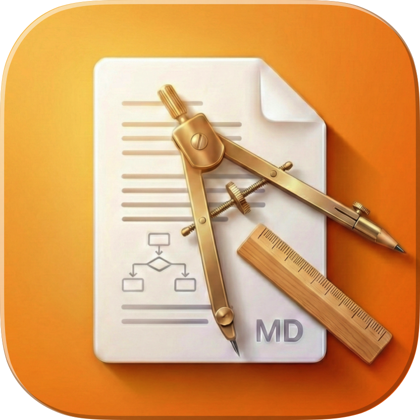

[English](README.md) | 日本語

# CCPlanView

<p align="center">
  
  <br>
  Claude Code のプランを表示する軽量 macOS マークダウンビューア
</p>

## 機能

- **GitHub 風マークダウン** - GitHub スタイルの美しいフォーマットで `.md` ファイルを表示
- **シンタックスハイライト** - highlight.js による主要言語のコードブロック対応
- **差分表示** - 追加行は緑、削除行は赤でハイライト
- **ダーク/ライトモード** - システム設定に応じて自動切り替え
- **URL スキームリフレッシュ** - `ccplanview://refresh?file=...` でオンデマンド更新
- **複数の開き方** - File > Open、ドラッグ＆ドロップ、Finder「このアプリケーションで開く」、ターミナルコマンド

## インストール

1. [Releases](https://github.com/Saqoosha/CCPlanView/releases) から最新の `.dmg` をダウンロード
2. DMG を開いて `CCPlanView.app` を Applications にドラッグ
3. アプリを起動してマークダウンファイルを開く

## 使い方

### ファイルを開く

```bash
# ターミナルからファイルを開く
open -a "CCPlanView" /path/to/file.md

# または .md ファイルをウィンドウにドラッグ＆ドロップ
```

### Claude Code Hooks との連携

CCPlanView は [Claude Code](https://docs.anthropic.com/en/docs/claude-code) のプランビューアとして最適。Claude がプランファイルを生成（`ExitPlanMode`）すると、hook が自動的に CCPlanView で開いて差分をハイライト表示する。

**アプリを起動するだけ** — Claude Code がインストールされていれば、hook を自動設定するか確認される。

以下の hook が `~/.claude/settings.json` に追加される：

```json
{
  "hooks": {
    "PreToolUse": [
      {
        "matcher": "ExitPlanMode",
        "hooks": [
          {
            "type": "command",
            "command": "/Applications/CCPlanView.app/Contents/MacOS/notifier",
            "timeout": 10
          }
        ]
      }
    ]
  }
}
```

> **Note**: パスはインストール時の実際のアプリ位置が反映される。

#### カスタムプランディレクトリ

デフォルトでは、notifier は `~/.claude/plans/` 内のプランファイルを探す。プロジェクトローカルなディレクトリを使うには、Claude Code 設定に [`plansDirectory`](https://docs.anthropic.com/en/docs/claude-code/settings#available-settings) を追加：

```json
// .claude/settings.json（プロジェクトレベル、チーム共有）
{
  "plansDirectory": "./.plans"
}
```

notifier は以下の順序で設定を確認：
1. `.claude/settings.local.json`（プロジェクト、個人用）
2. `.claude/settings.json`（プロジェクト、共有）
3. `~/.claude/settings.json`（グローバル）

---

## 開発

### 必要環境

- macOS 14.0+
- Xcode 16.0+
- [XcodeGen](https://github.com/yonaskolb/XcodeGen)

### ソースからビルド

```bash
git clone https://github.com/Saqoosha/CCPlanView.git
cd CCPlanView
./scripts/build.sh Release

# アプリの場所:
# build/DerivedData/Build/Products/Release/CCPlanView.app
```

### ビルドコマンド

```bash
./scripts/build.sh          # Debug ビルド
./scripts/build.sh Release  # Release ビルド
./scripts/package_dmg.sh    # DMG パッケージ作成（公証含む）
./scripts/release.sh 1.0.0  # 新バージョンリリース
```

### 技術スタック

- Swift 6.0 + SwiftUI + WKWebView
- [marked.js](https://github.com/markedjs/marked)（マークダウンパース）
- [highlight.js](https://highlightjs.org/)（シンタックスハイライト）
- [github-markdown-css](https://github.com/sindresorhus/github-markdown-css)（スタイリング）

### プロジェクト構成

```
Sources/
├── CCPlanView/          # メインアプリ（SwiftUI + WKWebView）
│   └── Resources/       # マークダウン表示用 HTML/CSS/JS
└── notifier/            # Claude Code hooks 用 CLI ツール
```

## ライセンス

MIT
